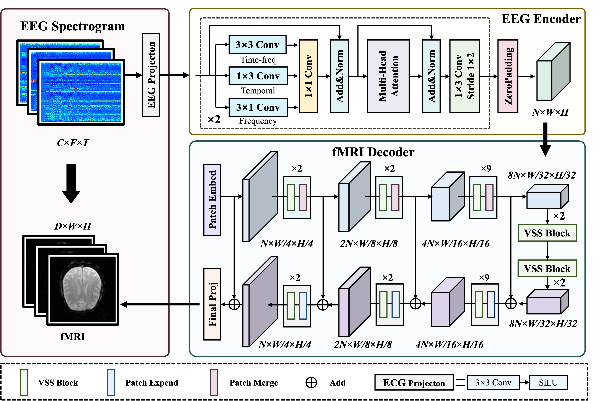
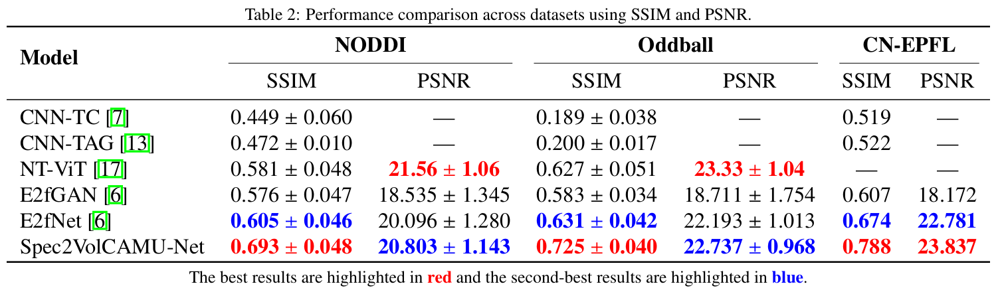
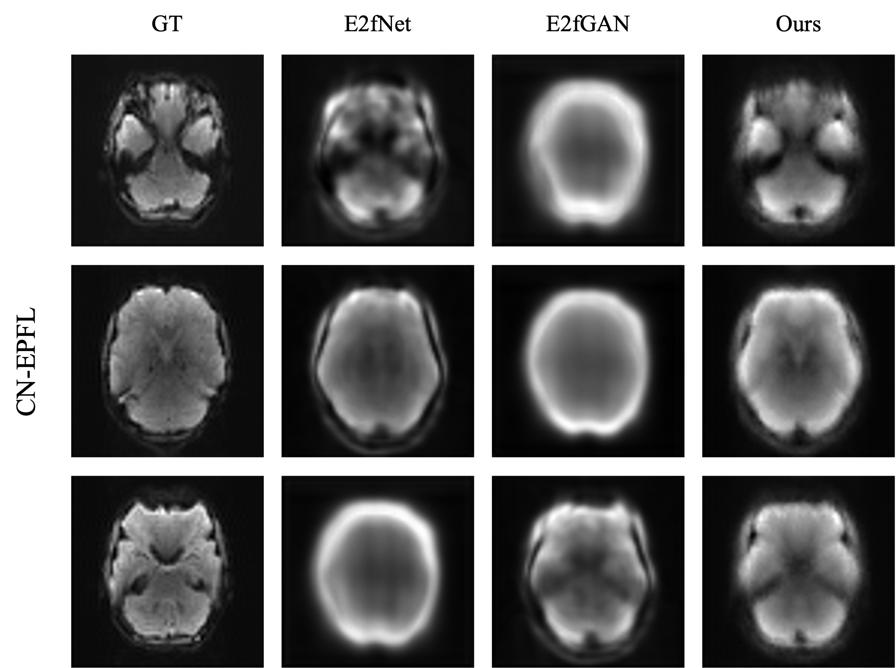
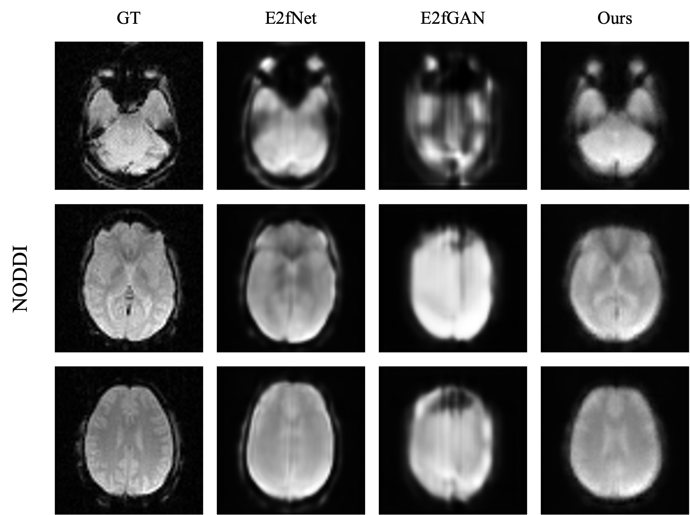
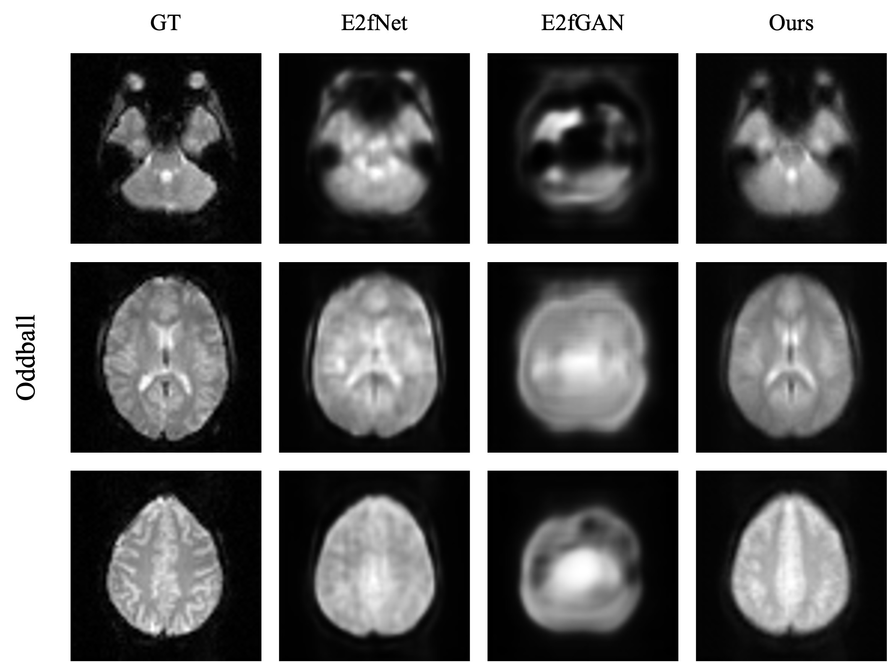

## Spec2VolCAMU-Net - Official Implementation
**A Spectrogram-to-Volume Model for EEG-to-fMRI Reconstruction based on Multi-directional Time-Frequency Convolutional Attention Encoder and Vision-Mamba U-Net**

**Authors:** Dongyi He, Shiyang Li, Bin Jiang, He Yan

**Affiliation:** School of Artificial Intelligence, Chongqing University of Technology, Chongqing, China

**Paper:** https://arxiv.org/abs/2505.09521

**Graphical Abstract**


**Abstract**
High-resolution functional magnetic resonance imaging (fMRI) is essential for mapping human brain activity; however, it remains costly and logistically challenging. If comparable volumes could be generated directly from widely available scalp electroencephalography (EEG), advanced neuroimaging would become significantly more accessible. Existing EEG-to-fMRI generators rely on plain CNNs that fail to capture cross-channel time-frequency cues or on heavy transformer/GAN decoders that strain memory and stability. We propose Spec2VolCAMU-Net, a lightweight spectrogram-to-volume generator that confronts these issues via a Multi-directional Time-Frequency Convolutional Attention Encoder, stacking temporal, spectral and joint convolutions with self-attention, and a Vision-Mamba U-Net decoder whose linear-time state-space blocks enable efficient long-range spatial modelling. Trained end-to-end with a hybrid SSI-MSE loss, Spec2VolCAMU-Net achieves state-of-the-art fidelity on three public benchmarks, recording SSIMs of 0.693 on NODDI, 0.725 on Oddball and 0.788 on CN-EPFL, representing improvements of 14.5%, 14.9%, and 16.9% respectively over previous best SSIM scores. Furthermore, it achieves competitive PSNR scores, particularly excelling on the CN-EPFL dataset with a 4.6% improvement over the previous best PSNR, thus striking a better balance in reconstruction quality. The proposed model is lightweight and efficient, making it suitable for real-time applications in clinical and research settings.

**Reach Highlights**
- We propose Spec2VolCAMU-Net, a novel EEG-to-fMRI synthesis model that effectively captures multi-scale features from EEG spectrograms using a Multi-directional Time-Frequency Convolutional Attention Encoder (MD-TF-CAE) and reconstructs fMRI volumes using a Vision-Mamba U-Net decoder.
- The proposed MD-TF-CAE captures both local and global features from EEG spectrograms through multi-directional convolutions and multi-head self-attention, addressing the challenges of comprehensive feature extraction and long-range dependency modeling.
-  We demonstrate superior performance of Spec2VolCAMU-Net compared to existing state-of-the-art methods across multiple public EEG-fMRI datasets (NODDI, Oddball, and CN-EPFL), particularly in achieving higher SSIM and competitive PSNR, indicating improved structural fidelity and detail accuracy in reconstructed fMRI volumes.

**Performance Comparison**


**Visual Results**




**Acknowledgements**
This work is supported by the Scientific and Technological Research Program of the Chongqing Education Commission (KJQN202201142), the Natural Science Foundation of Chongqing (2024NSCQ-MSX1731), the Chongqing University of Technology Research and Innovation Team Cultivation Program (2023TDZ012), the Chongqing Municipal Key Project for Technology Innovation and Application Development (CSTB2024TIAD-KPX0042), and the National Natural Science Foundation of P.R. China (61173184).

### Datasets pre-processing
See [datasets pre-processing](docs/datasets_howto.md) for download and pre-process all datasets

### Training
Modify [run_bash.sh](run_train.sh) and run
```bash
bash run_train.sh
```

### Inference
See [inference.ipynb](inference.ipynb) for more details.

### Citation
```
@article{he2025spec2volcamunetspectrogramtovolumemodeleegtofmri,
      title={Spec2VolCAMU-Net: A Spectrogram-to-Volume Model for EEG-to-fMRI Reconstruction based on Multi-directional Time-Frequency Convolutional Attention Encoder and Vision-Mamba U-Net}, 
      author={Dongyi He and Shiyang Li and Bin Jiang and He Yan},
      year={2025},
      eprint={2505.09521},
      archivePrefix={arXiv},
      primaryClass={eess.IV},
      url={https://arxiv.org/abs/2505.09521}, 
}
```

